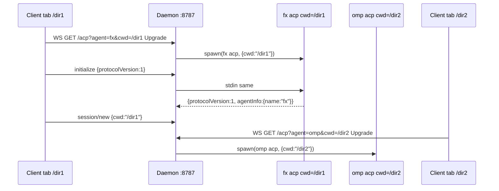

# ACP WebSocket bridge — universal daemon

A spec-compliant **custom transport** bridge that exposes any ACP stdio agent over WebSocket, preserving the identical JSON-RPC message format and ACP lifecycle as stdio.

ACP officially defines **stdio** and a draft **Streamable HTTP** transport ([transports.md](https://agentclientprotocol.com/protocol/transports)). This bridge is a **custom transport** (as permitted by the spec) that implements `GET /acp` with `Upgrade: websocket` as a full-duplex channel. It MUST preserve the JSON-RPC format and lifecycle defined by ACP.

Each WebSocket connection maps to one agent subprocess (`fx`, `omp`, `pi` via `pi-acp`, `opencode`, …) because most `ServerState` implementations hold a single active session per process. Multi-session-per-connection (Streamable HTTP) is not supported.

## Supported agents (P2)

| Agent | Command (config) | Notes |
| --- | --- | --- |
| `fx` | `fx acp` | Native ACP, honors per-session `cwd` directly (`src/acp/sessions.zig`) |
| `omp` | `omp acp` | Oh My Pi — native ACP over stdio (`omp acp --help`) |
| `pi` | `npx -y pi-acp` | via `svkozak/pi-acp` adapter that spawns `pi --mode rpc` and translates to ACP; no `fs`/`terminal` delegation, MCP passthrough only |
| `opencode` | `opencode acp` | ACP server with `--cwd` global flag, also honors `session/new cwd` |

All agents use the same JSON-RPC framing (`initialize → session/new → session/prompt → session/update → stopReason`) — the bridge is transport-only and never rewrites messages.

## Run

```sh
npm install
npm start
# [ws-bridge] listening on http://127.0.0.1:8787/acp (ws)
# [ws-bridge] agents: fx=fx acp, omp=omp acp, pi=npx -y pi-acp, opencode=opencode acp
```

Point the daemon at a built `fx` binary during development:

```sh
FX_PATH=/path/to/repo/zig-out/bin/fx npm start
```

Select the agent and cwd from the client — the daemon spawns in that dir and acts as a WS mediator (most ACP agents only support stdio):

```js
// 1 workspace = 1 WS = 1 proc (parallel dirs = 2 WS)
const ws1 = new WebSocket("ws://127.0.0.1:8787/acp?agent=fx&cwd=/home/user/dir1");
const ws2 = new WebSocket("ws://127.0.0.1:8787/acp?agent=omp&cwd=/home/user/dir2");
```

## Configuration

`ws-bridge/config.json` (committed example) drives the agent registry:

```json
{
  "defaultAgent": "fx",
  "allowCwdRoots": [],
  "agents": {
    "fx":       { "command": "fx",       "args": ["acp"], "env": {} },
    "omp":      { "command": "omp",      "args": ["acp"], "env": {} },
    "pi":       { "command": "npx",      "args": ["-y", "pi-acp"], "env": { "PI_ACP_ENABLE_EMBEDDED_CONTEXT": "true" } },
    "opencode": { "command": "opencode", "args": ["acp"], "env": {} }
  }
}
```

* `defaultAgent` — used when `?agent=` is omitted (default `fx`).
* `allowCwdRoots` — empty = any absolute `cwd` allowed; otherwise `cwd` must be under one of the roots or the bridge returns `403` (HTTP upgrade rejected) or `-32602` (JSON error for in-band `cwd`).
* Per-agent `env` is shallow-merged on top of the daemon's `process.env`.

Environment overrides (for local dev / tests, all optional):

| Variable | Default | Purpose |
| --- | --- | --- |
| `PORT` | `8787` | HTTP/WS listen port |
| `HOST` | `127.0.0.1` | Listen address |
| `DEFAULT_AGENT` | `config.defaultAgent` | Fallback when `?agent=` omitted |
| `BRIDGE_CONFIG_PATH` | `<bridge>/config.json` | Alternate config file |
| `ALLOW_CWD_ROOTS` | `config.allowCwdRoots` | Comma-separated allow list (`/home/user,/workspace`) |
| `FX_PATH` | `fx` | Path to the fx binary (overrides `agents.fx.command`) |
| `FX_ARGS` | `acp` | Arguments passed to fx (space-separated, overrides `agents.fx.args`) |

## Protocol

Single endpoint: `GET /acp`.

| Method | Behavior |
| --- | --- |
| `GET` | With `Upgrade: websocket` upgrades to a full-duplex channel. Query `?agent=` and `?cwd=` select the agent and spawn cwd. Unknown agent → `400`. Non-absolute or disallowed `cwd` → `400`/`403`. |
| `GET` | Without upgrade returns `426 Upgrade Required`. |
| `POST` | Returns `501` (Streamable HTTP profile not implemented). |
| `GET /` , `GET /health` | Returns `{"status":"ok","transport":"websocket","endpoint":"/acp","agents":["fx","omp","pi","opencode"],"defaultAgent":"fx"}` |
| `GET /agents` | Returns `{"agents":[...],"defaultAgent":"fx"}` |

On WebSocket upgrade the bridge assigns an `Acp-Connection-Id` (UUID) and sends it as an advisory `transport/connection` control frame (`{ jsonrpc:"2.0", method:"transport/connection", params:{ connectionId, agent } }`). Clients MUST still send `initialize` as the first JSON-RPC message over the socket, exactly as in stdio. All subsequent messages are plain JSON-RPC 2.0, one per WebSocket text frame. Binary frames are ignored.

When the socket closes, the subprocess is terminated (`SIGTERM` → `SIGKILL` after 1s). When the subprocess exits, a `transport/exit` control frame is sent and the socket closes. `transport/error` is sent if the agent fails to spawn (e.g. `pi-acp` not installed).

## Working directory (cwd)

The ACP spec defines `cwd` as a required absolute path in `session/new`, `session/load`, and `session/resume` and states it **MUST be used regardless of where the agent subprocess was spawned**. `cwd` remains the base for relative paths and part of the session's effective root set (`[cwd, ...additionalDirectories]`).

`fx` honors `cwd` directly per session (see `src/acp/sessions.zig`):
- `session/new` creates the session with the requested `cwd` (canonicalized via `realpath` when possible; falls back to the requested absolute path if the directory does not yet exist).
- `session/load` and `session/resume` validate that the requested `cwd` matches the stored session's `cwd` (error `-32602` otherwise).
- `additionalDirectories` is validated as an array of absolute paths.
- Tool execution uses `session.workspace_root` for `workspace_root` and `access_scope`, so `read`/`write`/`shell` operations resolve relative to the client-chosen directory.

`omp` and `opencode` also accept `cwd` in `session/new` (and `opencode` additionally has a process `--cwd` flag). The bridge does the same for all agents: it buffers the first messages for a short grace window (`50ms`) so a `cwd` arriving in `session/new` immediately after `initialize` can be used as the spawn `cwd`. If `?cwd=` is present on the WebSocket URL the bridge spawns eagerly in that directory (zero wait). If no `cwd` is seen within the grace period, the subprocess is spawned in the `?cwd` or bridge's own `cwd` and per-session `cwd` is still honored by the agent for all subsequent tool calls.

Parallel work in `/dir1` and `/dir2` → **two spawns** (two WS connections), because `ServerState` holds a single active session per process. A single WS cannot multiplex two `cwd`s concurrently — `session/new` would replace the active session.



## Constraints

This implements the **WebSocket-only** profile. The spec's Streamable HTTP profile (POST/GET/DELETE with SSE streams and multiple sessions per connection) is not supported, because a `ServerState` holds a single active session per process. Each WebSocket connection maps to one subprocess and one session.

For the full spec including multi-session Streamable HTTP, see the feasibility notes in the repository root.
